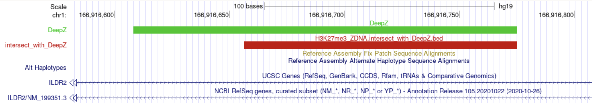

# hse21_H3K27me3_ZDNA_human
Финальный проект по курсу биоинформатики
## Часть 1 : Анализ пиков гистоновой метки

Скачиваем данные
```bash
mkdir data ; cd data
wget https://www.encodeproject.org/files/ENCFF291DHI/@@download/ENCFF291DHI.bed.gz
gunzip ENCFF291DHI.bed.gz
cut -f1-5 ENCFF291DHI.bed > H3K27me3_ZDNA.ENCFF291DHI.hg38.bed
wget https://www.encodeproject.org/files/ENCFF695ETB/@@download/ENCFF695ETB.bed.gz
gunzip ENCFF695ETB.bed.gz
cut -f1-5 ENCFF695ETB.bed > H3K27me3_ZDNA.ENCFF695ETB.hg38.bed
```
Так как версия генома - hg38, то приводим к версии hg19. LiftOver скачан с http://hgdownload.cse.ucsc.edu/admin/exe/macOSX.x86_64/liftOver.
```bash
cd ..
wget https://hgdownload.cse.ucsc.edu/goldenpath/hg38/liftOver/hg38ToHg19.over.chain.gz; gunzip  hg38ToHg19.over.chain.gz 
cd data
liftOver H3K27me3_ZDNA.ENCFF291DHI.hg38.bed ../hg38ToHg19.over.chain H3K27me3_ZDNA.ENCFF291DHI.hg19.bed H3K27me3_ZDNA.ENCFF291DHI.unmapped.bed
liftOver H3K27me3_ZDNA.ENCFF695ETB.hg38.bed ../hg38ToHg19.over.chain H3K27me3_ZDNA.ENCFF695ETB.hg19.bed H3K27me3_ZDNA.ENCFF695ETB.unmapped.bed
```
Строим гистрограммы: скрипт находится в текущем репозитории, дополнительно создаем директорию для сгенерированных гистрограмм
```bash
cd .. ; mkdir hists
```
Количество пиков в H3K27me3_ZDNA.ENCFF291DHI
- до конвертации (hg38) : 25268 
- после конвертации (hg19) : 25232 

Количество пиков в H3K27me3_ZDNA.ENCFF695ETB
- до конвертации (hg38) : 25814 
- после конвертации (hg19) : 25775 

В качестве порога для фильтрации пиков выбрано значение 500.


**Число пиков после фильтрации:**
- H3K27me3_ZDNA.ENCFF291DHI 19930
- H3K27me3_ZDNA.ENCFF695ETB 24747

**Расположение пиков относительно аннотированных генов**

Для эксперимента ENCFF291DHI


Для эксперимента ENCFF695ETB


Объединим метки из двух отфильтрованных наборов
```bash
cd data
cat  *.filtered.bed  |   sort -k1,1 -k2,2n   |   bedtools merge   >   H3K27me3_ZDNA.merge.hg19.bed
```


**Визуализируем данные в UCSC браузере**

Треки:
```bash
track visibility=dense name="ENCFF291DHI"  description="H3K27me3_ZDNA.ENCFF291DHI.hg19.filtered.bed"
https://raw.githubusercontent.com/Romanchenko/hse21_H3K27me3_ZDNA_human/main/data/H3K27me3_ZDNA.ENCFF291DHI.hg19.filtered.bed

track visibility=dense name="ENCFF695ETB"  description="H3K27me3_ZDNA.ENCFF695ETB.hg19.filtered.bed"
https://raw.githubusercontent.com/Romanchenko/hse21_H3K27me3_ZDNA_human/main/data/H3K27me3_ZDNA.ENCFF695ETB.hg19.filtered.bed


track visibility=dense name="ChIP_merge"  color=50,50,200   description="H3K27me3_ZDNA.merge.hg19.bed"
https://raw.githubusercontent.com/Romanchenko/hse21_H3K27me3_ZDNA_human/main/data/H3K27me3_ZDNA.merge.hg19.bed
```

Взглянув на картинку, убеждаемся в корректности работы утилиты merge


## Часть 2 : анализ участков вторичной структуры ДНК

Теперь повторим все этапы, кроме фильтрации, для вторичной структуры ДНК.

Скачиваем файл
```bash
cd data ; wget https://raw.githubusercontent.com/Nazar1997/DeepZ/master/annotation/DeepZ.bed
```

Число пиков: 19394

Распределение длин пиков:


Скрипт для определения расположения пиков структуры относительно аннотированного генома взят из пункта для пиков из экспериментов (просто изменены пути).


## Часть 3

Пересекаем bed-файлы со структурой ДНК и с метками из экспериментов
```bash
intersect  -a DeepZ.bed   -b H3K27me3_ZDNA.merge.hg19.bed > H3K27me3_ZDNA.intersect_with_DeepZ.bed
```
Число пиков: 837

Распределение длин пиков


Треки для геномного браузера:
```
track visibility=dense name="DeepZ"  color=0,200,0  description="DeepZ"
https://raw.githubusercontent.com/Romanchenko/hse21_H3K27me3_ZDNA_human/main/data/DeepZ.bed

track visibility=dense name="intersect_with_DeepZ"  color=200,0,0  description="H3K27me3_ZDNA.intersect_with_DeepZ.bed"
https://raw.githubusercontent.com/Romanchenko/hse21_H3K27me3_ZDNA_human/main/data/H3K27me3_ZDNA.intersect_with_DeepZ.bed
```


Сессия в браузере - http://genome.ucsc.edu/s/Romanchenko/hw_bioinf


Хорошие позиции в браузере
- chr1:27,286,914-27,286,985 -- тут есть пересечение с аннотированным геном RefSeq Gene KDF1 https://www.genecards.org/cgi-bin/carddisp.pl?gene=KDF1


- chr1:166,916,626-166,916,805 -- пересечение с интроном Human Gene ILDR2 https://www.genecards.org/cgi-bin/carddisp.pl?gene=ILDR2



Ассоциирование с имеющимися аннотированными генами дало результаты:
- всего ассоциаций пиков с генами 332
- уникальных генов 248 

Результаты GO-анализа

Некоторые наиболее значимые категории
- cell proliferation involved in metanephros developmen FDR = 1.66E-02
- regulation of resting membrane potential FDR = 2.63E-02
- adenylate cyclase-activating dopamine receptor signaling pathway FDR = 3.16E-02